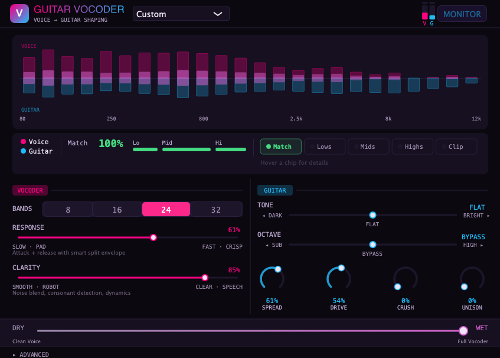

# Guitar Vocoder

A vocoder Audio Unit plugin for Logic Pro. Speak or sing into a mic while playing guitar — the plugin applies your voice's spectral shape to the guitar signal, making the guitar "speak." (Note: this will work with midi keyboards and other signals, but it's meant to play really well with bass and guitar.)

Built with [JUCE](https://juce.com/) and C++17. Developed by [Yacht Pockets](https://github.com/duncanwold).



## Author's Note

Fact: Vocoders are cool. From Kraftwerk to Chromeo, there's nothing like the man-machine-robo-funk of a vocoded vocal track. But vocoders tend to be the purview of keyboard players. And I am no keyboard player. I play guitar. So I built this plugin to make it really easy to get a nice sounding, intelligible vocoded vocal with just a dry guitar signal, and dry vocal signal together. And I think it came out pretty well.

This plugin can be used playing live, with pre-recorded tracks, or a mix of both. It can also make some pretty far out sounds (see the examples folder). I hope you enjoy playing with it as much as I enjoyed making it.

Cheers!

-Duncan

## Features

- **10 controls, no menu diving** — two macro knobs (Response + Clarity) control 9 internal parameters. An Advanced panel shows everything under the hood.
- **16-band vocoder** (configurable 8/16/24/32) with 4th-order bandpass filters for clean spectral isolation.
- **Guitar enrichment chain** — Tone, Octave (FFT phase vocoder), Spread, Drive (3-zone saturation → fuzz), Crush, and Unison (chorus-topology detune).
- **Intelligent voice processing** — auto-calibrating noise gate, voiced/unvoiced consonant detection, voice dynamics normalization, and a sibilant de-esser.
- **Real-time diagnostics** — split mirror visualizer, frequency coverage meters, and hint chips that suggest how to improve your guitar tone for better vocoder results.
- **15 factory presets** — from Talk Box and Zapp Bounce to Demon Voice and Broken Radio.

## Compatibility

| Format | DAW | Status |
|--------|-----|--------|
| **AU** | Logic Pro | ✅ Fully tested, primary target |
| **VST3** | REAPER, Cubase, Studio One | ✅ Tested in REAPER |
| **AAX** | Pro Tools | 🔜 Built, awaiting PACE signing |

All builds are macOS Apple Silicon (arm64) only.

## Requirements

- macOS (Apple Silicon)
- CMake 3.22+
- JUCE 7+ (installed via CMake)
- AAX SDK (optional, for Pro Tools builds — download from developer.avid.com)

## Build

First-time setup (installs Xcode CLI tools, Homebrew, CMake, and JUCE):

```bash
chmod +x setup.sh && ./setup.sh
```

Then build and install:

```bash
chmod +x build-install.sh && ./build-install.sh
```

This builds, signs, and installs AU + VST3 (and AAX if the AAX SDK is present at `~/AAX_SDK`). For notarized distributable builds:

```bash
./build-install.sh --notarize
```

Or build manually:

```bash
mkdir -p build && cd build
cmake .. -DCMAKE_PREFIX_PATH=$HOME/JUCE-installed
cmake --build . --config Release
```

Then copy the built plugins. The output path depends on your CMake generator:

```bash
# Makefile generator (default)
cp -r "GuitarVocoder_artefacts/AU/Guitar Vocoder.component" ~/Library/Audio/Plug-Ins/Components/
cp -r "GuitarVocoder_artefacts/VST3/Guitar Vocoder.vst3" ~/Library/Audio/Plug-Ins/VST3/

# Xcode generator
cp -r "GuitarVocoder_artefacts/Release/AU/Guitar Vocoder.component" ~/Library/Audio/Plug-Ins/Components/
cp -r "GuitarVocoder_artefacts/Release/VST3/Guitar Vocoder.vst3" ~/Library/Audio/Plug-Ins/VST3/
```

## Usage

1. Create an audio track in your DAW with your mic as input
2. Add **Guitar Vocoder** as an insert on the track
3. Set up the sidechain to route your guitar into the plugin (see the [install guide](https://github.com/duncanwold/GuitarVocoder/releases) for DAW-specific instructions)
4. Set the guitar track's output to **No Output** to prevent raw guitar going to speakers
5. Play guitar and sing — the Guitar column lights up when sidechain is connected

Start with the **Talk Box** preset and adjust **Clarity** for speech intelligibility and **Response** for envelope speed.

## Examples

See the [examples folder](examples/) for audio demos with dry vocals, dry guitar/bass, plugin settings, and vocoded output.

## Architecture

See [ARCHITECTURE.md](ARCHITECTURE.md) for detailed design decisions — why the de-esser lives inside the vocoder, why the gate never fully closes, why the octave latency isn't reported to the host, and what experiments were tried and removed.

See [CLAUDE.md](CLAUDE.md) for a technical reference of the signal flow, parameters, macro curves, and UI layout.

## License

MIT License — see [LICENSE](LICENSE).
