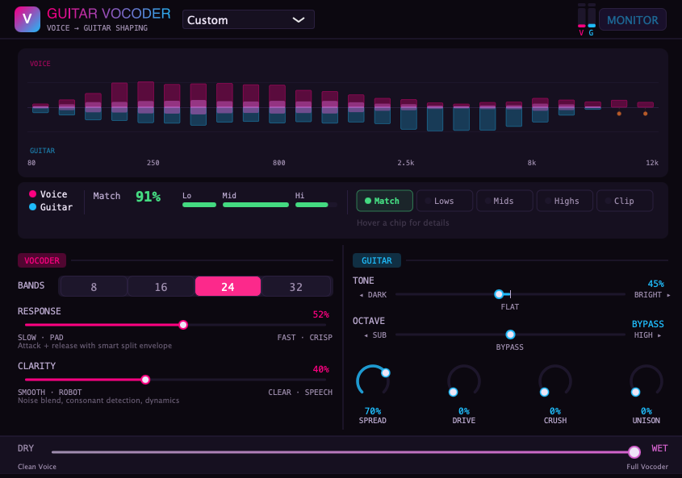
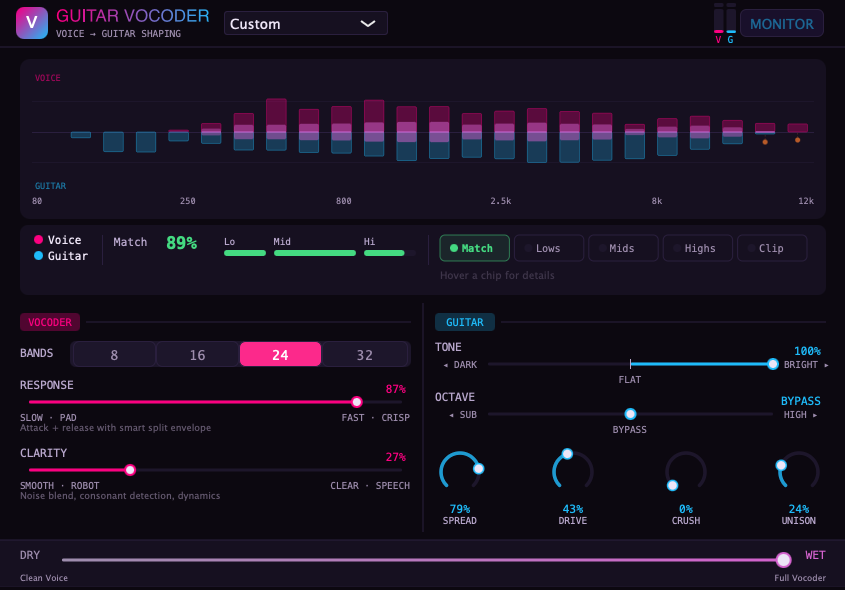
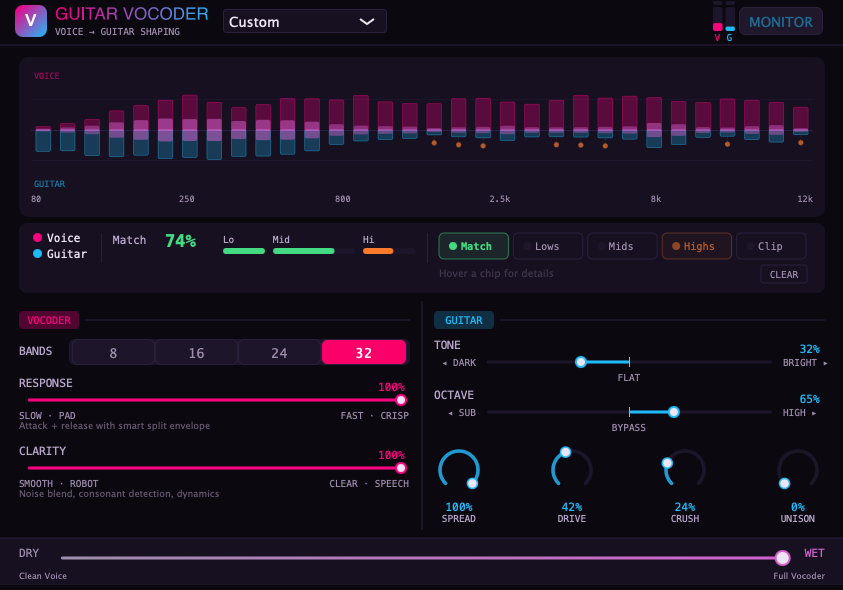

# Examples

Three examples showing Guitar Vocoder with different vocal styles, instruments, and settings. Each folder contains the dry vocal, dry guitar/bass, a screenshot of the plugin settings, and the vocoded output.

---

## 1 — Counting over Rhythm Guitar Chords

Spoken word over strummed guitar chords. A good starting point to hear how the vocoder tracks speech with a simple, full-spectrum carrier.

| File | Description |
|------|-------------|
| `ex1_vocals_dry.mp3` | Dry vocals (counting) |
| `ex1_guitar_dry.mp3` | Dry rhythm guitar chords |
| `ex1_vocoder_output.mp3` | Vocoded result |

**Settings:** 24 bands, Response 52%, Clarity 40%, Tone 45% (slightly dark), Spread 70%, Octave bypass, Drive/Crush/Unison off, 100% wet.

---

## 2 — Singing with Slide Guitar

Sung vocals over expressive slide guitar. High Response (87%) keeps the vocoder tight on the melodic phrasing. Drive at 43% and Unison at 24% thicken the carrier. Tone pushed fully bright (100%) to cut through.

| File | Description |
|------|-------------|
| `ex2_vocals_dry.mp3` | Dry singing vocals |
| `ex2_guitar_dry.mp3` | Dry slide guitar |
| `ex2_vocoder_output.mp3` | Vocoded result |

**Settings:** 24 bands, Response 87%, Clarity 27%, Tone 100% (bright), Spread 79%, Drive 43%, Unison 24%, Octave bypass, Crush off, 100% wet.

---

## 3 — Rap Vocals over Fast Picked Bass

Rap vocals over a fast picked bass line. Response and Clarity both maxed at 100% for maximum speech intelligibility — the fast delivery needs tight envelope tracking and full consonant detection. 32 bands for the finest spectral resolution. Octave pushed to 65% (high) to fill out the upper harmonics that bass lacks. Spread, Drive, and Crush add grit and width to compensate for the narrow-band carrier.

| File | Description |
|------|-------------|
| `ex3_vocals_dry.mp3` | Dry rap vocals |
| `ex3_bass_dry.mp3` | Dry picked bass |
| `ex3_vocoder_output.mp3` | Vocoded result |

**Settings:** 32 bands, Response 100%, Clarity 100%, Tone 32% (slightly bright), Octave 65% (high), Spread 100%, Drive 42%, Crush 24%, Unison off, 100% wet.

---

## Tips

- **Start with Example 1** if you're new to vocoders — it's the simplest setup.
- **Guitar chords work better than single notes** — more harmonics = more frequency coverage for the vocoder to work with.
- **Bass needs help** — when using bass as the carrier (Example 3), push Octave toward High and use Spread/Drive to fill the upper spectrum.
- **Response controls feel** — low Response (Example 1) gives a smooth, pad-like quality. High Response (Examples 2-3) gives a crisp, talk-box feel.
